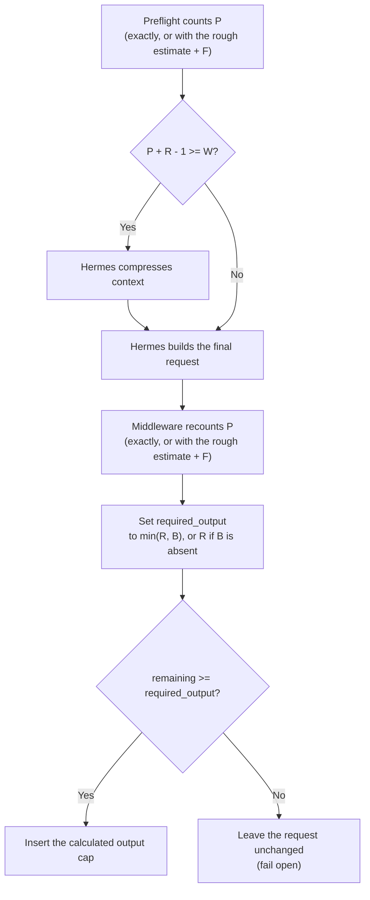

<details>
  <summary>ⓘ</summary>

[](https://github.com/pomponchik/incontext/actions/workflows/tests_and_coverage.yml)
[](https://github.com/pomponchik/incontext/actions/workflows/hermes_e2e.yml)
[](https://pypi.org/project/incontext/)
[](https://pypi.org/project/incontext/)
[](https://mypy-lang.org/)
[](https://github.com/astral-sh/ruff)

</details>


`incontext` is a Hermes Agent plugin that keeps enough room in Hermes'
compression window for a useful LLM response. It prevents an oversized fixed
output limit from crowding out input, but never replaces it with a limit so
small that the agent cannot produce a usable response.

## Algorithm

The policy runs in two stages: preflight decides whether Hermes must compress
the prompt, then middleware caps the output after the final request is built.
The policy uses these values:

- `W` is Hermes' effective compression boundary in tokens: Hermes starts
  compressing context when token pressure reaches it. It is normally resolved
  by the installed `ContextCompressor`; the emergency override described below
  can replace it.
- `P` is the provider-visible prompt size in tokens, counted exactly when
  possible.
- `R` is the minimum viable output reserve. It is configured with
  `INCONTEXT_MIN_OUTPUT_TOKENS` and defaults to `4096`. If Hermes has a smaller
  explicit global output cap, that cap becomes `R`; the plugin treats the
  operator's smaller limit as intentional.
- `B` is an optional positive output cap on an individual request.
- `F` is `INCONTEXT_FALLBACK_MARGIN_TOKENS`, used only when exact tokenization
  is unavailable.



Before Hermes constructs the main provider request, incontext reports token
pressure to its compression preflight. The individual request cap `B` is not
known at this stage, so preflight uses `R`:

```text
preflight_pressure = P + R - 1
```

Hermes compresses when that pressure is at least `W`. Therefore compression is
requested exactly when `W - P < R`. The subtraction of one is intentional: a
prompt with exactly `R` tokens of output space remains valid, while a prompt
with `R - 1` tokens does not.

After constructing the final request, the middleware recounts its
provider-visible prompt, so `P` may differ from the preflight value, and
computes:

```text
required_output = min(R, B) if B is present else R
remaining       = W - P
max_tokens      = min(remaining, B) if B is present else remaining
```

The middleware inserts the output cap only when `remaining >= required_output`.
Otherwise it leaves the request unchanged instead of forcing a predictably
truncated tool call or text fragment. Preflight is responsible for compression
on normal main turns; the same fail-open behavior protects call sites that
bypass it. Any additional wire-level output limit reported by the backend must
also leave at least `required_output` tokens.

If the caller supplies a positive cap below `R`, incontext preserves it and
requires at least that much remaining space before inserting an output cap.
This keeps deliberately bounded operations, such as context summaries and
generated titles, bounded. Without such a caller cap, incontext never
dynamically emits `max_tokens` below `R`; in particular it does not turn an
exhausted window into `max_tokens=1`.

Hermes auxiliary calls do not pass through the public `llm_request` middleware,
and Hermes omits `max_tokens` for most custom providers. The plugin therefore
applies the same budgeting rule to auxiliary requests that use the configured
primary route; requests to another model, provider, or endpoint pass through
unchanged. If exact tokenization fails, both preflight and middleware use
Hermes' rough estimate plus `F`, so they retain the same decision boundary. If
both estimators fail, the original request is left unchanged.

Startup rejects `F + R >= W`, because fallback counting could no longer
guarantee `R` output tokens.

This addresses the same output-budget arithmetic discussed in
[NousResearch/hermes-agent#38652](https://github.com/NousResearch/hermes-agent/issues/38652).

## Installation

Install the published package from PyPI and enable it using the same plugin
name, `incontext`:

```bash
python -m pip install incontext
hermes plugins enable incontext
```

To use the current development branch instead, install it directly from GitHub:

```bash
python -m pip install 'git+https://github.com/pomponchik/incontext.git@develop'
hermes plugins enable incontext
```

After installing or upgrading, configure the plugin as described below and
then restart any long-running Hermes gateway. Hermes discovers the plugin
through the official `hermes_agent.plugins` entry-point group; no source file
has to be copied into `$HERMES_HOME/plugins`.

## Configuration

The bundled `vllm` backend is selected by default. With Hermes' standard
context engine, the only required plugin setting is
`INCONTEXT_TOKENIZER_URL`, which must point to the `/tokenize` endpoint of the
same vLLM model Hermes uses. This example also shows the most commonly adjusted
optional settings at their default values:

```bash
export INCONTEXT_BACKEND='vllm'
export INCONTEXT_TOKENIZER_URL='https://inference.example/tokenize'
export INCONTEXT_TOKENIZER_TIMEOUT_SECONDS='30'
export INCONTEXT_FALLBACK_MARGIN_TOKENS='1024'
export INCONTEXT_MIN_OUTPUT_TOKENS='4096'
```

In normal operation, Hermes' `model.default`, `model.context_length`, and
`compression.threshold` remain the source of truth. The plugin constructs
Hermes' installed `ContextCompressor` and uses its resolved `threshold_tokens`
instead of copying version-sensitive arithmetic. Only the explicit emergency
override `INCONTEXT_COMPRESSION_WINDOW_TOKENS` replaces that resolved boundary.

The remaining variables are optional unless noted otherwise:

| Variable | Default | Meaning |
|---|---:|---|
| `INCONTEXT_BACKEND` | `vllm` | Backend name registered in `incontext.backends`; `vllm` is bundled |
| `INCONTEXT_TOKENIZER_TIMEOUT_SECONDS` | `30` | `/tokenize` request timeout |
| `INCONTEXT_TOKENIZER_USER_AGENT` | automatic | HTTP user agent derived from installed package metadata |
| `INCONTEXT_FALLBACK_MARGIN_TOKENS` | `1024` | Extra reserve only when exact tokenization fails |
| `INCONTEXT_MIN_OUTPUT_TOKENS` | `4096` | Minimum viable output budget before compression is required |
| `INCONTEXT_COMPRESSION_WINDOW_TOKENS` | unset | Emergency boundary override; required with a non-default Hermes context engine |

The former `HERMES_VLLM_TOKENIZER_*` and
`HERMES_DYNAMIC_BUDGET_FALLBACK_MARGIN_TOKENS` names remain supported for
migration, but `INCONTEXT_*` names take precedence and should be used in new
deployments.

## Replacing the inference backend

The budgeting core depends only on the abstract `incontext.Backend` contract,
not on vLLM itself. A backend provides exact token counting, cache invalidation,
a non-sensitive name for logs (`source`), and optional normalization of
provider-specific output fields.

Backends are registered by name and discovered through the
`incontext.backends` entry-point group. `INCONTEXT_BACKEND` selects one and
defaults to `vllm`.

The bundled `vllm` backend keeps all vLLM-specific tokenization and transport
logic outside the budgeting core.

A third-party distribution can provide another backend without changing
incontext. Its implementation subclasses the stable abstract contract and its
plugin module registers the backend under a new name:

```python
# acme_backend/plugin.py
from __future__ import annotations

from typing import Any, Dict

from incontext import Backend, backends


class AcmeBackend(Backend):
    @property
    def source(self) -> str:
        return "acme-tokenizer"

    def count(
        self,
        request: Dict[str, Any],
        *,
        context_length: int,
    ) -> int:
        ...

    def clear_cache(self) -> None:
        ...


@backends.plugin("acme")
def provide_acme_backend() -> Backend:
    return AcmeBackend()
```

The third-party package makes that module discoverable in `pyproject.toml`:

```toml
[project.entry-points."incontext.backends"]
acme = "acme_backend.plugin"
```

After installing the package, set `INCONTEXT_BACKEND` to its registered name
and restart Hermes:

```bash
export INCONTEXT_BACKEND='acme'
```

Startup fails if the selected backend is missing or registered more than once.
Each backend owns its specific settings.

## Safety properties

- With the bundled backend, vLLM applies its real chat template to messages, tools, and
  `chat_template_kwargs`; local tokenizer approximations are not used.
- The `max_model_len` returned by vLLM's `/tokenize` endpoint must equal Hermes'
  configured context length.
- If a request contains several supported output-cap fields (`max_tokens`,
  `max_completion_tokens`, or `max_output_tokens`), incontext uses the smallest
  positive value and emits the field expected by the backend. If an additional
  backend-reported limit is below the required reserve, the request is left
  unchanged.
- The incoming request is copied and never mutated.
- The bundled exact counter uses a bounded, thread-safe cache.
- The same exact counter is used for preflight and final budgeting.
- If `/tokenize` fails, Hermes' own rough estimator is used with an additional
  safety margin. If both counters fail, the middleware leaves the request
  unchanged instead of taking Hermes down.
- Logs contain counts and exception types, never prompts, credentials, or raw
  provider errors.

The tokenizer endpoint sees the prompt content by design. Run it on a trusted
network path and use the same access controls as the inference endpoint.
