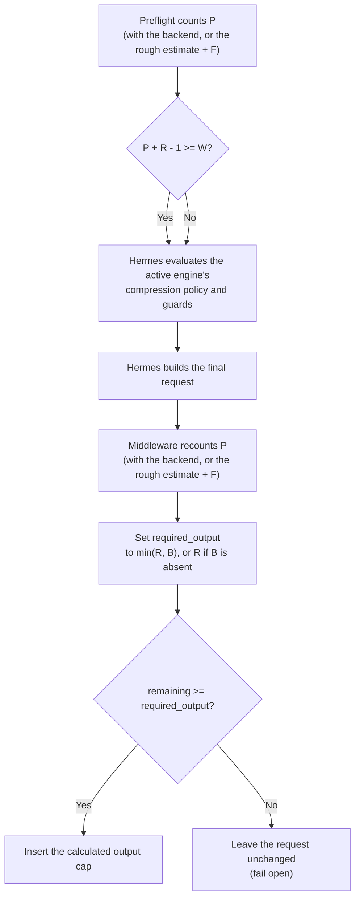

<details>
  <summary>ⓘ</summary>

[](https://pepy.tech/project/incontext)
[](https://pepy.tech/project/incontext)
[](https://coveralls.io/github/pomponchik/incontext?branch=develop)
[](https://github.com/boyter/scc/)
[](https://hitsofcode.com/github/pomponchik/incontext/view?branch=develop)
[](https://github.com/pomponchik/incontext/actions/workflows/tests_and_coverage.yml)
[](https://github.com/pomponchik/incontext/actions/workflows/hermes_e2e.yml)
[](https://pypi.org/project/incontext/)
[](https://pypi.org/project/incontext/)
[](https://mypy-lang.org/)
[](https://github.com/astral-sh/ruff)
[](https://deepwiki.com/pomponchik/incontext)

</details>


`incontext` is a [Hermes Agent](https://github.com/NousResearch/hermes-agent)
plugin that dynamically budgets output space against Hermes' active context
boundary. It inserts a cap only when the remaining space meets the configured
output reserve or a smaller caller-supplied cap; otherwise it leaves the request
unchanged.

## Algorithm

On normal main turns with automatic compression enabled, the policy runs in two
stages: preflight requests compression when needed, then middleware caps the
output after the final request is built. With compression disabled, only the
middleware stage runs, using `W` as defined below. The policy uses these values:

- `W` is incontext's active budgeting boundary in tokens. By default, it is the
  compressor threshold when automatic compression is enabled, or the full
  context window when it is disabled. With compression enabled, the threshold
  is resolved by the installed
  [`ContextCompressor`](https://hermes-agent.nousresearch.com/docs/developer-guide/context-compression-and-caching/);
  the emergency override supplies `W` directly but does not reconfigure Hermes.
  With automatic compression, an override must match the active context
  engine's actual boundary for preflight and middleware to share the same `W`.
- `P` is the prompt count used for budgeting: an exact or conservative
  provider-aware count when available, otherwise Hermes' rough estimate plus
  `F`.
- `R` is the configured output reserve. It is set with
  `INCONTEXT_MIN_OUTPUT_TOKENS` and defaults to `4096`. If Hermes has a smaller
  explicit output cap for the active route, that cap becomes `R`; the plugin
  treats the operator's smaller limit as intentional.
- `B` is an optional positive output cap on an individual request.
- `F` is `INCONTEXT_FALLBACK_MARGIN_TOKENS`, used only when backend counting is
  unavailable.



When automatic compression is enabled, incontext reports token pressure before
Hermes constructs the main provider request. The individual request cap `B` is
not known at this stage, so preflight uses `R`:

```text
preflight_pressure = P + R - 1
```

incontext makes the reported pressure reach or exceed `W` exactly when
`W - P < R`. Hermes then evaluates compression under its own guards, so reaching
`W` does not guarantee that compression will run. The subtraction of one is
intentional: a prompt with exactly `R` tokens of output space passes this check,
while a prompt with `R - 1` tokens does not.

After constructing the final request, the middleware recounts its
provider-visible prompt, so `P` may differ from the preflight value, and
computes:

```text
required_output = min(R, B) if B is present else R
remaining       = W - P
max_tokens      = min(remaining, B) if B is present else remaining
```

The middleware inserts the output cap only when `remaining >= required_output`.
Otherwise it leaves the request unchanged instead of forcing a predictably
truncated tool call or text fragment. With automatic compression enabled,
preflight requests compression on normal main turns; the same fail-open behavior
protects call sites that bypass it. Any additional wire-level output limit
reported by the backend must also leave at least `required_output` tokens.

If the caller supplies a positive cap below `R`, incontext preserves it and
requires at least that much remaining space before inserting an output cap.
This keeps deliberately bounded operations, such as context summaries and
generated titles, bounded. Without such a caller cap, incontext never
dynamically emits `max_tokens` below `R`; in particular it does not turn an
exhausted window into `max_tokens=1`.

Hermes auxiliary calls do not pass through the public `llm_request` middleware,
and Hermes omits `max_tokens` for most custom providers. The plugin therefore
applies the same budgeting rule to auxiliary requests that use the configured
primary route; requests to another model, provider, or endpoint pass through
unchanged. If backend counting fails, both preflight and middleware use their
respective Hermes rough estimates plus `F`. If both estimators fail in
middleware, the original request is left unchanged.

Startup rejects `F + R >= W`, because that would leave no room for even the
smallest fallback-counted prompt.

This addresses the same output-budget arithmetic discussed in
[NousResearch/hermes-agent#38652](https://github.com/NousResearch/hermes-agent/issues/38652).

## Installation

Install the published package from [PyPI](https://pypi.org/project/incontext/)
and [enable it](https://hermes-agent.nousresearch.com/docs/user-guide/features/plugins/)
using the same plugin name, `incontext`:

```bash
python -m pip install incontext
hermes plugins enable incontext
```

To use the current development branch instead, install it directly from GitHub:

```bash
python -m pip install 'git+https://github.com/pomponchik/incontext.git@develop'
hermes plugins enable incontext
```

After installing or upgrading, configure the plugin as described below and
then restart any long-running Hermes gateway. Hermes discovers the plugin
through the official `hermes_agent.plugins` entry-point group; no source file
has to be copied into `$HERMES_HOME/plugins`.

## Configuration

The bundled [vLLM](https://docs.vllm.ai/) backend is selected by default. Hermes
must provide `model.default` and a positive `model.context_length`. For the
bundled backend, `INCONTEXT_TOKENIZER_URL` is required and must point to a
[`/tokenize` endpoint](https://docs.vllm.ai/en/stable/serving/online_serving/#tokenize-apis)
with the same model, tokenizer, and chat-template configuration as Hermes'
primary inference route. This example also shows the most commonly adjusted
optional settings at their default values:

```bash
export INCONTEXT_BACKEND='vllm'
export INCONTEXT_TOKENIZER_URL='https://inference.example/tokenize'
export INCONTEXT_TOKENIZER_TIMEOUT_SECONDS='30'
export INCONTEXT_FALLBACK_MARGIN_TOKENS='1024'
export INCONTEXT_MIN_OUTPUT_TOKENS='4096'
```

Hermes' `model.default`, `model.context_length`, and `compression` settings
remain the source of truth. With automatic compression enabled, the plugin
constructs Hermes' installed `ContextCompressor` and uses its resolved
`threshold_tokens` instead of copying version-sensitive arithmetic. With
compression disabled, it uses `model.context_length`; the emergency override
`INCONTEXT_COMPRESSION_WINDOW_TOKENS` bypasses this discovery and declares the
budgeting boundary. It does not reconfigure Hermes' compressor or context
engine.

The remaining variables are optional unless noted otherwise:

| Variable | Default | Meaning |
|---|---:|---|
| `INCONTEXT_BACKEND` | `vllm` | Backend name registered in `incontext.backends`; `vllm` is bundled |
| `INCONTEXT_TOKENIZER_TIMEOUT_SECONDS` | `30` | `/tokenize` request timeout |
| `INCONTEXT_TOKENIZER_USER_AGENT` | automatic | HTTP user agent derived from installed package metadata |
| `INCONTEXT_FALLBACK_MARGIN_TOKENS` | `1024` | Extra reserve only when backend counting fails |
| `INCONTEXT_MIN_OUTPUT_TOKENS` | `4096` | Base output reserve; smaller active-route and request caps are handled as described above |
| `INCONTEXT_COMPRESSION_WINDOW_TOKENS` | unset | Explicit budgeting-boundary assertion; required with a non-default Hermes context engine |

The former `HERMES_VLLM_TOKENIZER_*` and
`HERMES_DYNAMIC_BUDGET_FALLBACK_MARGIN_TOKENS` names remain supported for
migration, but `INCONTEXT_*` names take precedence and should be used in new
deployments.

## Replacing the budgeting backend

The budgeting core depends only on the abstract `incontext.Backend` contract,
not on vLLM itself. A backend provides provider-aware prompt counting, cache
invalidation, a non-sensitive name for logs (`source`), and optional
normalization of provider-specific output fields.

Backends are registered by name and discovered through
[Python entry points](https://packaging.python.org/en/latest/specifications/entry-points/)
in the `incontext.backends` group. `INCONTEXT_BACKEND` selects one and defaults
to `vllm`.

The bundled `vllm` backend keeps all vLLM-specific tokenization and transport
logic outside the budgeting core.

A third-party distribution can provide another backend without changing
incontext. Its implementation subclasses the abstract contract and its
plugin module registers the backend under a new name:

```python
# acme_backend/plugin.py
from __future__ import annotations

from typing import Any, Dict

from incontext import Backend, backends


class AcmeBackend(Backend):
    @property
    def source(self) -> str:
        return "acme-tokenizer"

    def count(
        self,
        request: Dict[str, Any],
        *,
        context_length: int,
    ) -> int:
        ...

    def clear_cache(self) -> None:
        ...


@backends.plugin("acme")
def provide_acme_backend() -> Backend:
    return AcmeBackend()
```

The third-party package makes that module discoverable in `pyproject.toml`:

```toml
[project.entry-points."incontext.backends"]
acme = "acme_backend.plugin"
```

After installing the package, set `INCONTEXT_BACKEND` to its registered name
and restart Hermes:

```bash
export INCONTEXT_BACKEND='acme'
```

Startup fails if the selected backend is missing or registered more than once.
Each backend owns its specific settings.

## Safety properties

- For ordinary chat requests, the bundled backend has vLLM's `/tokenize`
  endpoint apply its real chat template to messages, tools, and
  `chat_template_kwargs`; no local tokenizer approximation is used on that
  path.
- The `max_model_len` returned by vLLM's `/tokenize` endpoint must equal Hermes'
  configured context length.
- If a request contains several supported output-cap fields (`max_tokens`,
  `max_completion_tokens`, or `max_output_tokens`), incontext uses the smallest
  positive value and emits the field expected by the backend. If an additional
  backend-reported limit is below the required reserve, the request is left
  unchanged.
- The incoming request is copied and never mutated.
- The bundled counter uses a bounded, thread-safe cache.
- The same counter is used for preflight and final budgeting.
- If `/tokenize` fails, Hermes' own rough estimator is used with an additional
  safety margin. If both counters fail, the middleware leaves the request
  unchanged instead of taking Hermes down.
- With the bundled backend, incontext's own log messages contain counts and
  exception types, never prompts, credentials, or raw provider errors.

The tokenizer endpoint sees the prompt content by design. Keep `/tokenize` on a
trusted network path and protect it with network-level controls; vLLM's built-in
API-key check does not cover this route.
